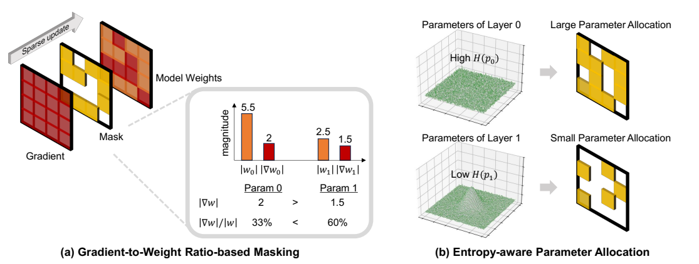

# GEM: A Scale-Aware and Distribution-Sensitive Sparse Fine-Tuning Framework for Effective Downstream Adaptation (AAAI-26 Main)

Official paper link: [https://ojs.aaai.org/index.php/AAAI/article/view/39410](https://ojs.aaai.org/index.php/AAAI/article/view/39410)

This repository contains the experimental training and evaluation code used during the development of **GEM: A Scale-Aware and Distribution-Sensitive Sparse Fine-Tuning Framework for Effective Downstream Adaptation**, accepted to the AAAI 2026 main conference.



## What Is Included

- A unified training and evaluation pipeline built on Hugging Face Transformers and DeepSpeed
- PEFT baselines such as LoRA, Adapter, BitFit, and full fine-tuning
- Sparse masking variants explored during the project, including random masking, gradient masking, grad/weight masking, and GEM
- Task templates and evaluation logic for classification, multiple-choice, and generation tasks

Deprecated branches that were only used during intermediate experiments were removed during cleanup. The public repository keeps the maintained task set and the modes that are still wired into `run.py`.

## Repository Layout

```text
.
├── PEFT/                    # PEFT modules and sparse masking implementations
├── ds_config_zero2.json     # DeepSpeed ZeRO-2 config
├── ds_config_zero3.json     # DeepSpeed ZeRO-3 config
├── metrics.py               # Evaluation metrics
├── run.py                   # Main training / evaluation entrypoint
├── run.sh                   # Single-run launcher
├── run_experiments.sh       # Example sweep launcher
├── tasks.py                 # Task definitions and dataset loading
├── templates.py             # Prompt templates
└── utils.py                 # Shared utilities
```

## Environment

Recommended:

- Python 3.9+
- CUDA-enabled PyTorch
- DeepSpeed for launcher-based training

Install core dependencies:

```bash
pip install -r requirements.txt
```

## Supported Tasks

Implemented task loaders currently include:

- `SST2`
- `RTE`
- `BoolQ`
- `WIC`
- `MultiRC`
- `Copa`
- `SQuAD`

Classification-style tasks use the standard evaluation path, while `SQuAD` uses generative evaluation with F1.

## Supported Modes

The launcher currently supports:

- `fft`
- `lora`
- `adapter`
- `bitfit`
- `random_masking`
- `gradient_masking`
- `gradweight_masking`
- `entropy_gradweight_masking`

`entropy_gradweight_masking` is the GEM method. The historical mode name is kept so older experiment commands still map to the same implementation.

## Quick Start

Run a single experiment:

```bash
MODEL=facebook/opt-1.3b \
TASK=RTE \
MODE=entropy_gradweight_masking \
MASKING_PROB=0.999 \
LR=1e-5 \
SEED=42 \
DEEPSPEED_INCLUDE=localhost:0 \
bash run.sh
```

Run a small sweep:

```bash
TASKS="RTE WIC" \
MODES="entropy_gradweight_masking random_masking" \
SEEDS="28 210" \
bash run_experiments.sh
```

Outputs default to:

- `outputs/` for temporary checkpoints
- `results/` for experiment logs

You can override these with environment variables such as `OUTPUT_ROOT`, `RESULT_DIR`, `DEEPSPEED_CONFIG`, and `DEEPSPEED_INCLUDE`.


## Citation

```bibtex
@article{Kang_Kim_Avestimehr_Lee_2026, title={GEM: A Scale-Aware and Distribution-Sensitive Sparse Fine-Tuning Framework for Effective Downstream Adaptation}, volume={40}, url={https://ojs.aaai.org/index.php/AAAI/article/view/39410}, DOI={10.1609/aaai.v40i27.39410}, abstractNote={Parameter-efficient fine-tuning (PEFT) has become a popular way to adapt large pre-trained models to new tasks. Most PEFT methods update only a small subset of parameters while freezing the rest, avoiding redundant computation. As they maximize the absolute size of the updates without regard to the parameters’ original scale, the resulting changes in model behavior can be minimal. In contrast, we maximize updates relative to each parameter’s scale, yielding more meaningful downstream adaptation. We propose Gradient-to-Weight Ratio and Entropy-guided Masking (GEM), a parameter scale-aware, distribution-sensitive sparse fine-tuning framework. GEM prioritizes parameters whose updates are significant in proportion to their initial pre-trained values. It also adaptively determines how many parameters to tune at each layer based on the entropy of parameter values, thereby making the most effective use of the computational budget in PEFT. Our empirical study demonstrates the efficacy of GEM on both general-domain tasks (GLUE and SuperGLUE) and domain-specific tasks (GSM8k and MBPP), achieving up to a 1.6% improvement in fine-tuning accuracy over full fine-tuning while updating only 0.1% of model parameters.}, number={27}, journal={Proceedings of the AAAI Conference on Artificial Intelligence}, author={Kang, Sungmin and Kim, Jisoo and Avestimehr, Salman and Lee, Sunwoo}, year={2026}, month={Mar.}, pages={22509-22517} }
```

## License

This project is released under the Apache License 2.0. See the [LICENSE](LICENSE) file for details.

Refactor note: This repository has been heavily refactored by Codex GPT-5.4
